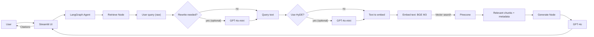

# צ'אטבוט RAG בעברית לפסיכולוגיה ובריאות הנפש  
**LangGraph · Pinecone · BGE‑M3 · OpenAI · Streamlit**

מערכת צ'אטבוט חכמה ואינטראקטיבית בשפה העברית, המתמחה בתחום הפסיכולוגיה ובריאות הנפש. הידע שעליו נשענת המערכת נאסף מתוך הפורטל המקצועי **"בטיפולנט"**, כדי להבטיח הסתמכות על תוכן טיפולי ומהימן.  
הפתרון בנוי בארכיטקטורת **RAG (Retrieval‑Augmented Generation)**, מנוהל באמצעות **LangGraph** (State + Memory), ומציע ממשק משתמש מלא ב‑**Streamlit** עם **Streaming** וחוויית שיחה טבעית.  

> ⚠️ **אחריות ובטיחות (Guardrails):** המערכת אינה מספקת אבחנות רפואיות או המלצות טיפוליות אישיות. היא מיועדת למידע כללי בלבד, עם הנחיות מערכת שמגבילות תוכן רגיש ומפחיתות הזיות.

---

## תוכן עניינים
- [סקירה](#overview)
- [מאגר הידע](#knowledge-base)
- [דוגמאות לשאלות](#example-questions)
- [חשיבה מוצרית והחלטות אסטרטגיות](#product-thinking)
- [ארכיטקטורת המערכת](#architecture)
- [טכנולוגיות](#tech)
- [יכולות מתקדמות](#features)
- [התקנה והרצה](#getting-started)
- [הערות חשובות](#notes)

---

<a id="overview"></a>
## סקירה
המערכת תוכננה מראש כפתרון **אנטרפרייז** עם דגש על:
- **תמיכה מלאה בעברית** (כולל RTL בממשק, והטמעת ידע בעברית).
- **מודולריות** וארכיטקטורה נקייה (Data → Retrieval → Generation → UI).
- **שקיפות** באמצעות הצגת מקורות (Chunks + Similarity Score).
- **התמודדות עם מגבלות RAG קלאסיות** (איבוד הקשר בשאלות המשך, רגישות להזיות, וכד').

---

<a id="knowledge-base"></a>
## מאגר הידע (Knowledge Base)
המערכת נבנתה על בסיס **4 מסמכי PDF בעברית**, המשמשים כ־Knowledge Base ראשוני. כל מסמך מכסה נושא מרכזי, עם הגדרות, סימפטומים, גורמים ודרכי טיפול:

- **Anxiety.pdf** — הפרעות חרדה: הגדרה והבחנה בין פחד לחרדה, סימפטומים (רגשיים/גופניים/קוגניטיביים/התנהגותיים), סוגים מרכזיים (פאניקה, חרדה חברתית, פוביות, חרדה מוכללת) ודרכי טיפול (CBT, דינמי, תרופתי).  
- **Depression.pdf** — דיכאון: מהו דיכאון, תסמינים, גורמים (ביולוגיים/פסיכולוגיים/סביבתיים), סוגים מרכזיים (מז׳ורי, דיסתימיה ועוד), מתי לפנות לטיפול ושיטות טיפול נפוצות.  
- **Eating disorders.pdf** — הפרעות אכילה: סוגים לפי DSM‑5 (אנורקסיה, בולימיה, התקפי זלילה ועוד), גורמים, השפעות פיזיות ונפשיות ודרכי טיפול (כולל גישה רב‑מערכתית).  
- **Trauma.pdf** — טראומה ו־PTSD: מהי הפרעת דחק פוסט‑טראומטית, תסמינים אופייניים, קריטריוני אבחנה (DSM‑5‑TR), גורמי סיכון וגישות טיפול מרכזיות (למשל טיפול ממוקד‑טראומה ו‑EMDR).

> 💡 להרחבה: ניתן להוסיף מסמכים נוספים (PDF/טקסט), לבצע Preprocessing ו‑Indexing מחדש, ולשפר את הכיסוי הנושאי של הצ׳אטבוט.

<a id="example-questions"></a>
## דוגמאות לשאלות רלוונטיות
להלן דוגמאות לשאלות “טובות” שמתאימות ל־RAG על בסיס ה־Knowledge Base (כולל שאלות המשך):

### חרדה (Anxiety)
- מה ההבדל בין פחד לחרדה?  
- מהם הסימפטומים הגופניים והקוגניטיביים הנפוצים בחרדה?  
- מה זה התקף פאניקה, ואילו סימנים יכולים להופיע בו?  
- מה ההבדל בין חרדה חברתית לפוביה ספציפית?  
- אילו שיטות טיפול נפוצות בחרדה (CBT לעומת טיפול דינמי לעומת טיפול תרופתי)?

### דיכאון (Depression)
- מהם התסמינים המרכזיים של דיכאון קליני?  
- אילו גורמים יכולים לתרום להתפתחות דיכאון (ביולוגיים/פסיכולוגיים/סביבתיים)?  
- מה ההבדל בין דיכאון מז׳ורי לדיכאון מתמשך (דיסתימיה)?  
- מתי מומלץ לפנות לטיפול בדיכאון?  
- אילו סוגי טיפול קיימים בדיכאון (CBT / פסיכודינמי / תרופתי)?

### הפרעות אכילה (Eating Disorders)
- אילו סוגים של הפרעות אכילה קיימים לפי DSM‑5?  
- מה ההבדל בין בולימיה להפרעת התקפי זלילה?  
- אילו השפעות פיזיות יכולות להיות להפרעות אכילה?  
- מהן גישות טיפול מקובלות ומה כולל טיפול רב‑מערכתי?

### טראומה ו‑PTSD (Trauma)
- מהי PTSD ומה ההבדל בינה לבין תגובת דחק “נורמלית” אחרי אירוע?  
- מהם תסמינים חודרניים והימנעות, ואיך הם נראים ביום‑יום?  
- מהן גישות טיפול מבוססות ראיות ל‑PTSD (למשל EMDR או טיפול בחשיפה)?  
- מה ההבדל בין Acute Stress Disorder ל‑PTSD?

---

<a id="product-thinking"></a>
## חשיבה מוצרית והחלטות אסטרטגיות
הפרויקט נבנה מתוך ראייה מוצרית, ולא כתרגיל טכני “בוואקום”. לאחר מיפוי פרופיל לקוחות אנטרפרייז (גופים ממשלתיים, משרד הבריאות, בנקים ומוסדות ציבוריים), התקבלה החלטה אסטרטגית לפתח את המערכת **מקצה לקצה סביב עברית**:

- **אתגר NLP בעברית:** רוב מודלי השפה אומנו בעיקר על אנגלית. כדי לשפר Retrieval בעברית, נבחר מודל ההטמעה **BAAI/bge‑m3** בזכות היכולות הרב‑לשוניות המוכחות שלו.
- **אמינות ובטיחות:** הדומיין (פסיכולוגיה ובריאות הנפש) מאפשר להדגים טיפול נכון במידע רגיש. הוגדרו **System Prompts** שמגבילים תשובות מסוכנות (למשל אבחנות / ייעוץ רפואי).

---

<a id="architecture"></a>
## ארכיטקטורת המערכת
המערכת מחולקת לשלוש שכבות עיקריות: **Data**, **RAG Engine**, ו‑**UI**.

### 1) Data Ingestion & Preprocessing
- חילוץ טקסט מ‑PDF וניקוי בסיסי (כפילויות, נרמול רווחים ושורות).
- **Semantic‑ish Chunking** (ב־`src/preprocess.py`):  
  במקום חיתוך “עיוור” לפי תווים, האלגוריתם מזהה גבולות של פסקאות/משפטים ושומר **Overlap** של 1–2 משפטים בין Chunks כדי לא לאבד הקשר.

### 2) Vector DB & Indexing
- כל Chunk מקודד לוקטור Embedding ומועלה ל‑**Pinecone**.
- לכל וקטור מצורף **Metadata עשיר** (שם מסמך, נושא, מזהים וכו’) — לצורך מעקב, סינון והצגת מקורות.

### 3) LangGraph Agent (מנוע ה‑RAG)
הזרימה מנוהלת באמצעות **StateGraph** עם שני Nodes עיקריים:

- **Retrieve**  
  מקבל את שאלת המשתמש. אם קיימת היסטוריית שיחה, מופעל מודל מהיר ליצירת **Standalone Query** (שכתוב השאלה לפי הקשר).  
  בנוסף, קיימת תמיכה ב‑**HyDE (Hypothetical Document Embeddings)** — יצירת “מסמך היפותטי” לשיפור החיפוש הסמנטי.

- **Generate**  
  מקבל את התוכן שנשלף (מעל **Similarity Threshold** מינימלי) ומייצר תשובה בעברית על בסיס ה‑System Prompt, תוך חסימת הזיות/מידע רפואי רגיש.

#### תרשים זרימה (Mermaid)


---

<a id="tech"></a>
## 🛠️ טכנולוגיות
- **LangGraph & LangChain** – ניהול State, זרימת עבודה Agentic, וזיכרון (Session Memory) באמצעות **SQLite Checkpointer**.
- **Pinecone (Vector DB)** – חיפוש וקטורי (Cosine Similarity) בענן.
- **BAAI/bge‑m3** (HuggingFace / SentenceTransformers) – Embeddings רב‑לשוני איכותי, מתאים במיוחד לעברית.
- **OpenAI (GPT‑4o & GPT‑4o‑mini)**  
  - `gpt-4o` ל‑Generation (תשובות בעברית ברמה גבוהה)  
  - `gpt-4o-mini` למשימות מהירות/זולות (Standalone Query, HyDE)
- **Streamlit** – ממשק משתמש בצורת צ'אט, עם התאמות CSS ל‑RTL ותמיכה ב‑Streaming.
- **Pydantic & pydantic-settings** – ניהול קונפיגורציה מבוססת `.env`, עם ולידציה Type‑Safe.

---

<a id="features"></a>
## ✨ יכולות מתקדמות (Extra Points)
- **Session Memory עם Checkpointer**: שמירת State לכל משתמש (Thread ID) כדי לנהל דיאלוג רציף.
- **Contextualize Query**: שכתוב שאלות המשך ל‑Standalone Query ברור לפני החיפוש הווקטורי.
- **Streaming Responses**: הצגת תשובות בזמן אמת (Token‑by‑Token) להפחתת latency נתפס.
- **Citations / שקיפות**: הצגת קטעי המקור (Chunks) + Similarity Score בתוך Expander בממשק.

---

<a id="getting-started"></a>
## 🚀 התקנה והרצה (Getting Started)

### 1) דרישות קדם
- Python **3.9+** (מומלץ 3.10+)
- חשבון פעיל ב‑OpenAI
- חשבון פעיל ב‑Pinecone

### 2) Environment Setup
שכפלו את המאגר והתקינו תלויות:

```bash
git clone <your-repo-link>
cd <your-repo-folder>

python -m venv venv

# Mac/Linux
source venv/bin/activate

# Windows
venv\Scripts\activate

pip install -r requirements.txt
```

### 3) הגדרת משתני סביבה (.env)
צרו קובץ בשם `.env` בתיקיית השורש והוסיפו:

```dotenv
OPENAI_API_KEY=your_openai_api_key_here
PINECONE_API_KEY=your_pinecone_api_key_here
PINECONE_INDEX_NAME=therapy-rag
```

> ניתן להגדיר משתנים נוספים דרך `src/config.py` (למשל: מודל Embedding, ספי רגישות ועוד).

### 4) הכנת נתונים והטמעה (Data Processing & Indexing)
> 💡 כדי לחסוך זמן, קובצי ה‑PDF המקוריים וה‑Chunks המעובדים (JSONL) כבר קיימים בתיקיית `data` במאגר.

**(אופציונלי) Preprocessing מחדש:**
```bash
python -m src.preprocess
```

**Indexing ל‑Pinecone:**
```bash
python -m src.index_embeddings
```

### 5) הפעלת המערכת (Running the App)
יש שני ממשקי שימוש:

**אופציה א' – Streamlit UI (מומלץ):**
```bash
streamlit run app.py
```

**אופציה ב' – CLI לבדיקות מהירות:**
```bash
python -m src.cli_chat --thread-id user_1
```

---

<a id="notes"></a>
## הערות חשובות
- **RTL בממשק:** הממשק מותאם ל‑RTL באמצעות CSS ייעודי. אם אתם רואים ערבוב כיווניות, ודאו שה‑CSS נטען ושאין רכיב/קומפוננטה שמכריחה LTR.
- **איכות Retrieval בעברית:** ה‑Embedding model (`bge-m3`) הוא רכיב קריטי לדיוק האחזור בטקסט עברי.
- **בטיחות:** גם עם Guardrails, אין לראות בתשובות ייעוץ אישי. במצבים דחופים — לפנות לאיש מקצוע מוסמך.

---

### קרדיט
הידע במאגר נשען על תכנים מהפורטל **"בטיפולנט"**.

